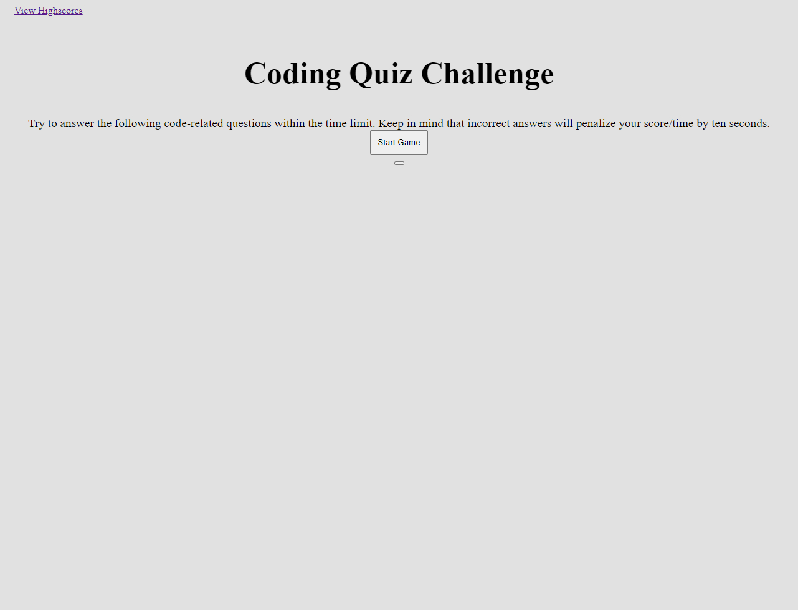

# Coding-quiz
Quiz game to test some of your coding knowledge!


## Description
Main topic: Javascript + working with the DOM

This is a quiz game built with Javascript that is meant to be run in the browser. After creating a quiz array that holds the questions and answers, dom elements are selected and after the start button is pressed an event listener goes off and a startGame() executes. The array is looped through after each answer is checked and if the answer is wrong a users score is reduced and the quiz continues. After answering all questions a user can post their score to the highscore page.


## Screenshot



## Link
[Click here](https://johnfoxwell.github.io/coding-quiz/)


## Developed by:
```
John Foxwell
```